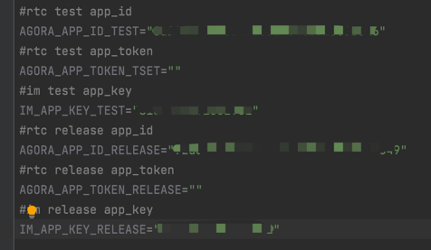

# AgoraSenceDemo

### 介绍

### 软件架构

软件架构说明

##### basicdepend 依赖的一层壳

* 依赖component和common

##### business：业务

* chatroom 语聊房
* ......

##### component：组件

* RtcKit 音视频
* IMKit IM
* SceneUI 场景化
* ......

##### common：基础

* basui 基础ui
* buddy 工具类
* config 配置
* network 网络封装
* ......

#### 使用说明

* app 直接引用 <basicdepend> 和相应的business，比如chatroom
* chatroom 也可以作为单独app 运行（修改gradle.properties 中 isChatroomModule=true ）
* rtc appId，appToken,im appKey 放在local.properties 中， 客户集成项目需要在"local.properties" 中新增如下配置：

* 修改gradle.properties 中 isBuildTypesTest=true 打包不同环境的apk

#### 参与贡献
